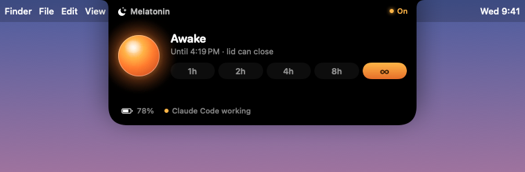
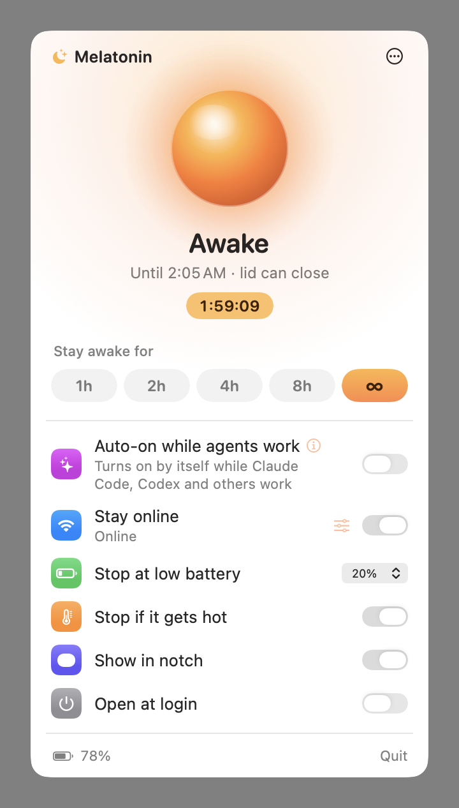
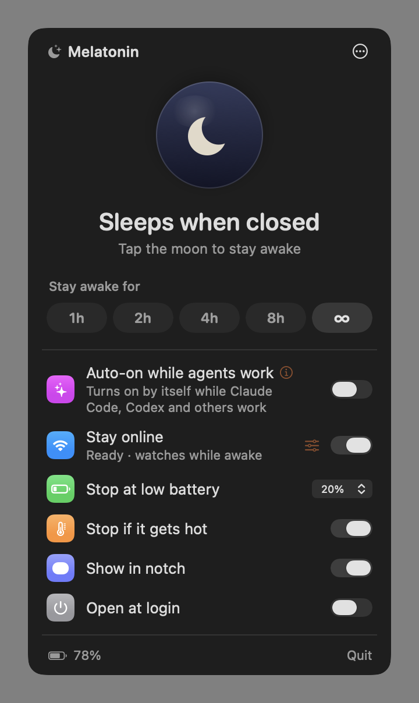
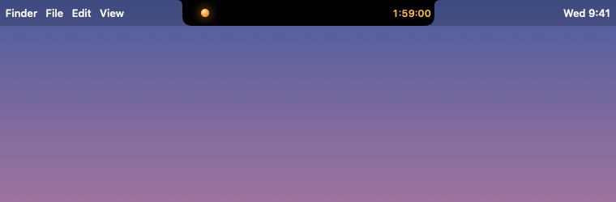
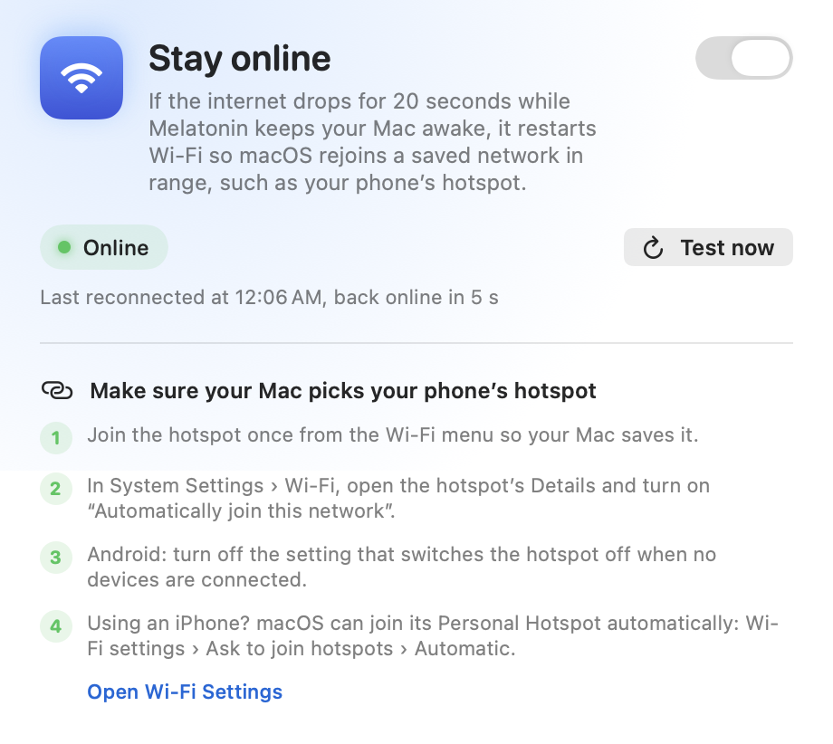

<p align="center">
  
</p>

<h1 align="center">Melatonin</h1>

<p align="center">
  <b>Fermez l’écran. Vos agents continuent de tourner.</b><br>
  Une toute petite app pour la barre des menus de macOS qui garde votre MacBook éveillé écran fermé —<br>
  sur batterie, sans écran externe — pendant que Claude Code, Codex et compagnie terminent leur travail.
</p>

<p align="center">
  <a href="https://github.com/jugol/Melatonin/releases/latest/download/Melatonin.dmg"><b>Télécharger</b></a> ·
  <a href="https://jugol.github.io/Melatonin/">Site web</a>
</p>

<p align="center">
  <a href="README.md">English</a> ·
  <a href="README.ko.md">한국어</a> ·
  <a href="README.zh-Hans.md">简体中文</a> ·
  <a href="README.ja.md">日本語</a> ·
  <a href="README.es.md">Español</a> ·
  <a href="README.fr.md">Français</a> ·
  <a href="README.de.md">Deutsch</a> ·
  <a href="README.pt-BR.md">Português</a> ·
  <a href="README.ru.md">Русский</a> ·
  <a href="README.ar.md">العربية</a> ·
  <a href="README.hi.md">हिन्दी</a> ·
  <a href="README.id.md">Bahasa Indonesia</a>
</p>

<p align="center">
  
</p>

## Pourquoi

Vous lancez une longue tâche dans Claude Code, vous fermez l’écran et vous partez. macOS se met en veille, et la tâche s’arrête net.

Les apps anti-veille comme `caffeinate`, KeepingYouAwake et la plupart de leurs cousines s’appuient sur des assertions d’alimentation, que macOS ignore dès que l’écran se ferme. La seule chose qui empêche vraiment la mise en veille à la fermeture de l’écran, c’est `pmset disablesleep`, et il faut pour cela les droits root. Melatonin l’enveloppe dans un petit utilitaire privilégié doté de garde-fous stricts, et place l’interrupteur là où vous le verrez : dans l’encoche.

## Fonctionnalités

- **Niché dans l’encoche.** Quand Melatonin est activé, une lampe chaleureuse s’allume à côté de la caméra et affiche le temps restant. Survolez-la pour déployer toutes les commandes. Sur les écrans sans encoche, la pastille se suspend à la barre des menus.
- **Interrupteur dans la barre des menus.** Un simple contour de croissant de lune : votre Mac se mettra en veille. Un croissant qui tient une lampe ambrée : il restera éveillé.
- **Minuteurs.** 1, 2, 4 ou 8 heures, ou jusqu’à ce que vous le désactiviez.
- **Auto pour les agents IA.** Reste éveillé uniquement quand un agent travaille vraiment : Claude Code, Codex, Hermes, OpenCode, T3 Code, Gemini CLI, Cursor Agent, Amp, Goose ou Crush. La détection surveille l’activité CPU de toute l’arborescence de processus de chaque agent : un agent qui attend sagement à son invite ne compte donc pas. Les agents lancés par T3 Code sont attribués à T3 Code.
- **Rester en ligne.** Si Internet est coupé pendant que Melatonin garde votre Mac éveillé, par exemple quand vous fermez l’écran et vous éloignez du Wi-Fi du bureau, il redémarre le Wi-Fi pour que macOS rejoigne un réseau enregistré à portée, comme le partage de connexion de votre téléphone. macOS ne permet pas aux apps de choisir un réseau Wi-Fi par son nom : assurez-vous donc que le partage de connexion est enregistré avec l’option **Rejoindre automatiquement ce réseau** activée. Un bouton **Tester maintenant** vous montre que tout fonctionne.
- **La sécurité avant tout.**
  - Sur batterie, se désactive au seuil de charge que vous choisissez (20 % par défaut).
  - Se désactive si votre Mac chauffe trop. Un portable allumé dans un sac fermé, c’est le meilleur moyen de cuire une batterie.
  - Si Melatonin se ferme, plante ou est arrêté de force, l’utilitaire rétablit aussitôt la veille normale. Il fait aussi le ménage après un redémarrage.
- **Natif et léger.** SwiftUI et AppKit, pas d’Electron, environ 0 % de CPU au repos. Binaire universel pour les Mac Apple silicon et Intel.
- **Parle votre langue.** English, 한국어, 简体中文, 日本語, Español, Français, Deutsch, Português (Brasil), Русский, العربية, हिन्दी et Bahasa Indonesia. Suit la langue de macOS par défaut ; choisissez-en une autre dans **⋯ › Langue**.

<p align="center">
  
  
</p>

<p align="center">
  
</p>

<p align="center">
  
</p>

## Installation

Nécessite macOS 14 Sonoma ou une version ultérieure.

**Téléchargement :** récupérez [Melatonin.dmg](https://github.com/jugol/Melatonin/releases/latest/download/Melatonin.dmg) dans la [dernière version](https://github.com/jugol/Melatonin/releases/latest) et faites glisser l’app dans le dossier Applications.

**Homebrew :**

```bash
brew install --cask jugol/tap/melatonin
```

**Premier lancement :** les premières versions ne sont pas encore notariées par Apple, donc macOS bloque le premier lancement. Ouvrez **Réglages Système › Confidentialité et sécurité** et cliquez sur **Ouvrir quand même**, ou exécutez :

```bash
xattr -dr com.apple.quarantine /Applications/Melatonin.app
```

La première fois que vous activez Melatonin, macOS vous demande votre mot de passe, une seule fois, pour installer l’utilitaire.

**Depuis les sources :** il vous faut les Xcode Command Line Tools (`xcode-select --install`).

```bash
git clone https://github.com/jugol/Melatonin.git
cd Melatonin
make run
```

## Fonctionnement

```
Melatonin.app  ──XPC──▶  io.github.jugol.melatonin.helper (root, launchd)
  UI, timers,              pmset -a disablesleep 1 / 0
  safety checks,           …and back to 0 when the app disconnects
  connection watch         networksetup -setairportpower (Wi-Fi off and on)
```

- **L’utilitaire a une surface d’attaque minimale.** Toute son interface se résume à `setSleepDisabled(Bool)` plus deux appels Wi-Fi : redémarrer le Wi-Fi et rejoindre un réseau déjà enregistré sur le Mac. Il n’a pas accès au shell et n’exécute aucune commande arbitraire. Voir [`Sources/MelatoninHelper/main.swift`](Sources/MelatoninHelper/main.swift).
- **Il ne parle qu’à Melatonin.** Les connexions XPC doivent satisfaire une exigence de signature de code liée à l’identifiant de bundle de l’app.
- **En cas de problème, retour à la normale.** La veille reste désactivée uniquement tant qu’une app connectée le demande. Si la connexion tombe, la veille revient. Un fichier témoin prend le relais en cas de redémarrage de l’utilitaire ou du Mac.
- **L’installation et la désinstallation sont de simples scripts shell** que vous pouvez lire : [`Support/install-helper.sh`](Support/install-helper.sh) et [`Support/uninstall-helper.sh`](Support/uninstall-helper.sh).

## Désinstallation

Choisissez **⋯ › Désinstaller l’utilitaire…** dans le menu, puis supprimez l’app. Pour supprimer l’utilitaire manuellement :

```bash
sudo bash Support/uninstall-helper.sh
```

## Développement

```bash
make app        # build build/Melatonin.app (ad-hoc signed)
make run        # build and launch
make package    # universal build, DMG and zip in dist/
make icon       # regenerate the app icon from Scripts/make-icon.swift
swift build && .build/debug/Melatonin --snapshot /tmp/shots   # render every UI state to PNGs
swift build && .build/debug/Melatonin --agents                 # watch agent detection live
```

Après avoir ajouté ou modifié une traduction, lancez `python3 Scripts/check-localizations.py` pour repérer les chaînes manquantes et les marqueurs incohérents.

Pour signer avec un Developer ID, définissez `SIGN_IDENTITY` et fixez l’identifiant de votre équipe (team ID) dans `HelperConstants.clientRequirement` :

```bash
SIGN_IDENTITY="Developer ID Application: Your Name (TEAMID)" make app
```

## Feuille de route

- [ ] Versions signées et notariées, cask Homebrew et mises à jour via Sparkle
- [ ] Rester en ligne : choisir le réseau enregistré à rejoindre (nécessite l’accès à la localisation)
- [ ] Intégration des hooks Claude Code pour des signaux de début et de fin précis
- [ ] Résumé « Pendant votre absence » à l’ouverture de l’écran

## Licence

[MIT](LICENSE)
