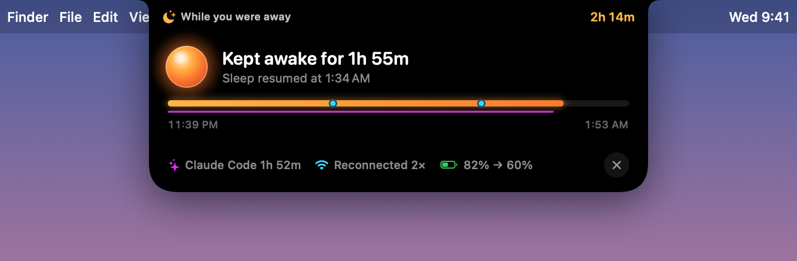

<p align="center">
  
</p>

<h1 align="center">Melatonin</h1>

<p align="center">
  <b>Закройте крышку. Агенты продолжат работу.</b><br>
  Крошечное приложение для строки меню macOS, которое не дает MacBook уснуть с закрытой крышкой —<br>
  от батареи и без внешнего монитора, — пока Claude Code, Codex и компания доводят дело до конца.
</p>

<p align="center">
  <a href="https://github.com/jugol/Melatonin/releases/latest/download/Melatonin.dmg"><b>Скачать</b></a> ·
  <a href="https://jugol.github.io/Melatonin/">Сайт</a>
</p>

<p align="center">
  <a href="README.md">English</a> ·
  <a href="README.ko.md">한국어</a> ·
  <a href="README.zh-Hans.md">简体中文</a> ·
  <a href="README.ja.md">日本語</a> ·
  <a href="README.es.md">Español</a> ·
  <a href="README.fr.md">Français</a> ·
  <a href="README.de.md">Deutsch</a> ·
  <a href="README.pt-BR.md">Português</a> ·
  <a href="README.ru.md">Русский</a> ·
  <a href="README.ar.md">العربية</a> ·
  <a href="README.hi.md">हिन्दी</a> ·
  <a href="README.id.md">Bahasa Indonesia</a>
</p>

<p align="center">
  
</p>

## Зачем

Вы запускаете в Claude Code долгую задачу, закрываете крышку и уходите. macOS засыпает — и работа обрывается на полпути.

`caffeinate`, KeepingYouAwake и большинство похожих утилит используют power assertions — системные запросы «не засыпать», — а macOS перестает их учитывать, как только закрывается крышка. По-настоящему удержать Mac от сна при закрытой крышке может только `pmset disablesleep`, а для этого нужны права root. Melatonin поручает эту команду маленькому привилегированному помощнику со строгими предохранителями, а переключатель выносит на самое видное место — в вырез экрана.

## Возможности

- **Живет в вырезе.** Когда Melatonin включен, рядом с камерой загорается теплая лампа и видно, сколько времени осталось. Наведите курсор — откроется полная панель управления. На дисплеях без выреза плашка просто свисает со строки меню.
- **Переключатель в строке меню.** Контур полумесяца — Mac уснет; полумесяц с янтарной лампой внутри — не уснет.
- **Таймеры.** 1, 2, 4 или 8 часов — или пока вы сами не выключите.
- **Луна, авто, лампа.** Один переключатель под лампой: «**Выкл.**» — Mac засыпает как обычно, «**Авто**» — не спит, только пока работают агенты, «**Вкл.**» — не спит до конца таймера, а потом возвращается в прежний режим.
- **Авторежим для ИИ-агентов.** Mac не спит, только пока агент действительно работает: Claude Code, Codex, Hermes, OpenCode, T3 Code, Gemini CLI, Cursor Agent, Amp, Goose или Crush. Melatonin следит за загрузкой CPU во всем дереве процессов каждого агента, так что агент, который просто ждет вашего ввода, не в счет. Агенты, запущенные из T3 Code, засчитываются T3 Code.
- **Оставаться на связи.** Если интернет пропадёт, пока Melatonin не даёт Mac уснуть (например, вы закрыли крышку и вышли из зоны офисного Wi-Fi), он подключится к первой доступной сети из списка приоритетов, который вы выбираете среди сохранённых сетей, например к точке доступа телефона. Чтобы выбирать сети по имени, нужен доступ к геопозиции: macOS показывает имена Wi-Fi только приложениям с этим доступом, а само местоположение не используется. Если ни одна сеть не подошла, он перезапускает Wi-Fi, чтобы macOS сама подключилась к сохранённой сети.
- **Пока вас не было.** Когда вы вернётесь, вырез расскажет, что произошло: сколько Melatonin не давал Mac уснуть, какие агенты и сколько работали, сколько раз восстанавливалось Wi-Fi и сколько ушло заряда.
- **Безопасность прежде всего.**
  - При работе от батареи выключается, когда заряд падает до выбранного порога (по умолчанию 20%).
  - Выключается, если Mac перегревается. Работающий ноутбук в закрытой сумке — верный способ поджарить батарею.
  - Если Melatonin завершится, упадет или будет принудительно закрыт, помощник сразу вернет обычный режим сна. После перезагрузки он тоже все приводит в порядок.
- **Нативный и легкий.** SwiftUI и AppKit, никакого Electron, в простое — около 0% CPU. Универсальная сборка для Apple silicon и Intel.
- **Говорит на вашем языке.** English, 한국어, 简体中文, 日本語, Español, Français, Deutsch, Português (Brasil), Русский, العربية, हिन्दी и Bahasa Indonesia. По умолчанию следует языку macOS, а другой можно выбрать в **⋯ › Язык**.

<p align="center">
  
  
</p>

<p align="center">
  
</p>

<p align="center">
  
</p>

<p align="center">
  
</p>

## Установка

Требуется macOS 14 Sonoma или новее.

**Скачать:** загрузите [Melatonin.dmg](https://github.com/jugol/Melatonin/releases/latest/download/Melatonin.dmg) из [последнего релиза](https://github.com/jugol/Melatonin/releases/latest) и перетащите приложение в папку «Программы».

**Homebrew:**

```bash
brew install --cask jugol/tap/melatonin
```

Релизы подписаны Developer ID и заверены Apple, поэтому открываются как любое другое приложение.

Когда вы впервые включите Melatonin, macOS один раз попросит пароль, чтобы установить помощника.

**Из исходников:** понадобятся Xcode Command Line Tools (`xcode-select --install`).

```bash
git clone https://github.com/jugol/Melatonin.git
cd Melatonin
make run
```

## Как это работает

```
Melatonin.app  ──XPC──▶  io.github.jugol.melatonin.helper (root, launchd)
  UI, timers,              pmset -a disablesleep 1 / 0
  safety checks,           …and back to 0 when the app disconnects
  connection watch         networksetup -setairportpower (Wi-Fi off and on)
```

- **Помощник умеет совсем немного.** Весь его интерфейс — `setSleepDisabled(Bool)` и еще два вызова для Wi-Fi: перезапустить Wi-Fi и подключиться к сети, уже сохраненной на Mac. Доступа к оболочке у него нет, произвольных команд он не выполняет. См. [`Sources/MelatoninHelper/main.swift`](Sources/MelatoninHelper/main.swift).
- **Он общается только с Melatonin.** XPC-подключения должны соответствовать требованию к подписи кода для идентификатора пакета приложения.
- **Сбой не страшен.** Сон остается отключенным, только пока подключенное приложение об этом просит. Как только соединение обрывается, сон возвращается. Перезапуски помощника и перезагрузки подстрахованы файлом-маркером.
- **Установка и удаление — обычные shell-скрипты**, которые можно прочитать: [`Support/install-helper.sh`](Support/install-helper.sh) и [`Support/uninstall-helper.sh`](Support/uninstall-helper.sh).

## Удаление

Выберите в меню **⋯ › Удалить помощника…**, затем удалите приложение. Чтобы удалить помощника вручную:

```bash
sudo bash Support/uninstall-helper.sh
```

## Разработка

```bash
make app        # build build/Melatonin.app (signed with the best identity on this Mac)
make run        # build and launch
make package    # universal build, DMG and zip in dist/
make icon       # regenerate the app icon from Scripts/make-icon.swift
swift build && .build/debug/Melatonin --snapshot /tmp/shots   # render every UI state to PNGs
swift build && .build/debug/Melatonin --agents                 # watch agent detection live
```

Добавили или изменили перевод — запустите `python3 Scripts/check-localizations.py`: он найдет пропущенные строки и несовпадающие плейсхолдеры.

Сборки подписываются Developer ID этого Mac, если он есть; иначе локальным сертификатом из `Scripts/make-signing-identity.sh` (доступ к геопозиции сохраняется между сборками); иначе ad hoc. `make package` ещё и заверяет приложение у Apple, если есть профиль связки ключей notarytool с именем `melatonin`. Чтобы подписать своим Developer ID, задайте `SIGN_IDENTITY`:

```bash
SIGN_IDENTITY="Developer ID Application: Your Name (TEAMID)" make app
```

## Планы

- [x] Подписанные и заверенные Apple релизы, cask для Homebrew
- [x] Оставаться на связи: подключение к сохранённым сетям в выбранном порядке
- [x] Сводка «Пока вас не было», когда вы возвращаетесь
- [ ] Обновления через Sparkle
- [ ] Интеграция с хуками Claude Code для точного определения начала и конца работы

## Лицензия

[MIT](LICENSE)
